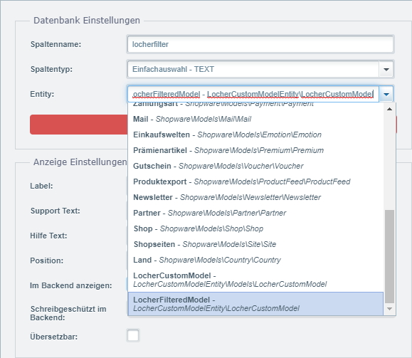

# LocherCustomModelEntity

This plugin demonstrates *two* things:
* It establishes a **new model** with its own database table.  
* It **reuses an existing model-entity** and applies an additional filter on it.

There are many models but this plugin specifically addresses the models used in freetext-fields (custom attributes).
